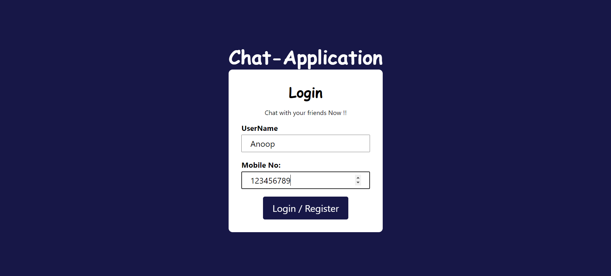
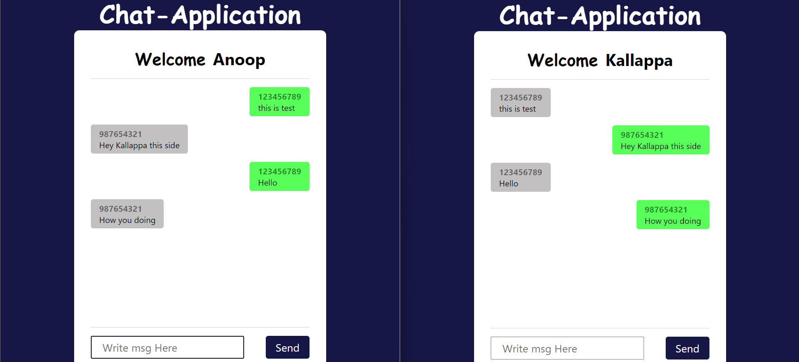

# Chat Application

## Overview

This Chat Application is a simple and efficient web-based tool for real-time communication. It allows users to register, log in, and exchange messages seamlessly. Built with PHP, JavaScript, and CSS, this application is a great starting point for learning and implementing chat functionalities in web development.

## Features

- **User Authentication**: Secure login and registration system.
- **Real-time Messaging**: Send and receive messages instantly.
- **User-friendly Interface**: Simple and intuitive design for easy navigation.

## Screenshots

### Login Page



### Chat Interface



## Installation

1. **Clone the Repository**:
   ```bash
   git clone https://github.com/AnoopVL/Chat-application.git
   ```
2. **Navigate to the Project Directory**:
   ```bash
   cd Chat-application
   ```
3. **Setup Database**:

   - Create a database and import the provided SQL file.
   - Update the database configuration in `db.php`.

4. **Run the Application**:
   - Ensure your web server is running and navigate to the project directory in your browser.

## Development

- **Languages**: PHP, JavaScript, HTML, CSS
- **Database**: MySQL

## Contributing

Contributions are welcome! Please follow these steps:

1. Fork the repository.
2. Create a new branch (`git checkout -b feature-branch`).
3. Make your changes and commit (`git commit -m 'Add some feature'`).
4. Push to the branch (`git push origin feature-branch`).
5. Create a new Pull Request.
